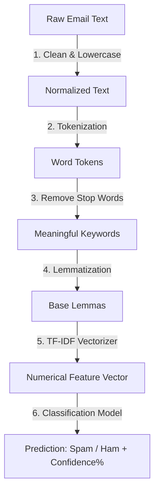

# Step-by-Step Curriculum: Building a Spam Email Detection System (Django + Machine Learning)

This guide is designed for **students** and **instructors** learning how to build an AI-powered text classification web portal from scratch. It explains the "what", "why", and "how" behind every phase of development.

---

## 🗺️ Conceptual Overview (For Beginners)

Before writing code, let's understand how a machine learning model detects spam:



1. **Text Preprocessing (NLP)**: Computers do not understand words; they understand numbers. We clean the email by stripping special characters, breaking sentences into lists of words (**Tokenization**), removing irrelevant fillers like "the/is/and" (**Stop Words**), and converting verbs/plurals to their root form (**Lemmatization**).
2. **Feature Extraction (TF-IDF)**: We calculate the importance of words in the email relative to the entire dataset, representing each email as a coordinate vector of numbers.
3. **Supervised Classification**: We feed these numbers into a trained algorithm (**Logistic Regression**) which outputs a probability score representing whether the text is a legitimate message ("Ham") or "Spam".
4. **Django Presentation**: We wrap this model in a web interface using Django, saving predictions in a database history log.

---

## 🛠️ Step 1: Environment Setup & Dependencies

First, we need to create an isolated sandbox (Virtual Environment) and install our Python packages.

### 1. Create a Project Folder and Virtual Environment
Run the following in your terminal:
```bash
# Create directory and enter it
mkdir SpamEmailProject
cd SpamEmailProject

# Create virtual environment (naming it .venv)
python -m venv .venv
```

### 2. Specify Dependencies
Create a file named `requirements.txt` and add these packages:
```text
django>=5.0        # Web framework to build the portal
scikit-learn>=1.3.0 # Machine Learning library containing Naive Bayes and Logistic Regression
pandas>=2.1.0      # Data manipulation tool to load datasets
numpy>=1.26.0      # Multi-dimensional arrays library
nltk>=3.8.1        # Natural Language Toolkit for NLP cleaning
joblib>=1.3.0      # Serializer to save and load trained ML models
```

Install them:
```bash
# Activate env (Windows PowerShell)
.venv\Scripts\Activate.ps1

# Install requirements
pip install -r requirements.txt
```

### 3. Download Natural Language Toolkit (NLTK) Corpora
NLTK requires downloading grammatical dictionary packages (stopwords lists, word definition tokens):
```bash
python -c "import nltk; nltk.download('stopwords'); nltk.download('wordnet'); nltk.download('punkt'); nltk.download('punkt_tab')"
```

---

## 🧠 Step 2: The Machine Learning Pipeline (`ml_model/train.py`)

Create a folder named `ml_model`. Inside, we'll write `train.py` to download dataset, clean text, and train models.

### Part A: Import Libraries & Configure Paths
```python
import os
import urllib.request
import re
import pandas as pd
import numpy as np
import nltk
import joblib

from nltk.corpus import stopwords
from nltk.tokenize import word_tokenize
from nltk.stem import WordNetLemmatizer

from sklearn.model_selection import train_test_split
from sklearn.feature_extraction.text import TfidfVectorizer
from sklearn.naive_bayes import MultinomialNB
from sklearn.linear_model import LogisticRegression
from sklearn.metrics import accuracy_score, classification_report

# Paths
BASE_DIR = os.path.dirname(os.path.abspath(__file__))
DATASET_FILE = os.path.join(BASE_DIR, 'data', 'spam_dataset.tsv')
DATASET_URL = "https://raw.githubusercontent.com/justmarkham/DAT8/master/data/sms.tsv"
```

### Part B: The NLP Cleaning Function
This function takes raw, noisy text and spits out clean keywords.

```python
def clean_and_preprocess_text(text):
    if not isinstance(text, str):
        return ""
    
    # 1. Lowercase (normalization)
    text = text.lower()
    
    # 2. Keep only alphabetical letters (strips numbers, punctuation, emojis)
    text = re.sub(r'[^a-zA-Z\s]', '', text)
    
    # 3. Tokenization (slicing text into list of words)
    words = word_tokenize(text)
    
    # 4. Stop Words & Lemmatizer setup
    stop_words = set(stopwords.words('english'))
    lemmatizer = WordNetLemmatizer()
    
    # Remove stopwords, and reduce remaining words to their base root lemma
    # e.g., 'studies' -> 'study', 'winning' -> 'win'
    cleaned_words = [lemmatizer.lemmatize(word) for word in words if word not in stop_words]
    
    # Rejoin words into a space-separated sentence
    return " ".join(cleaned_words)
```

### Part C: Loading Data and Model Training
We fetch the data, apply cleaning, convert words to vectors, and evaluate algorithms.

```python
def train_models():
    # Download dataset programmatically if not cached
    if not os.path.exists(DATASET_FILE):
        os.makedirs(os.path.dirname(DATASET_FILE), exist_ok=True)
        urllib.request.urlretrieve(DATASET_URL, DATASET_FILE)
    
    # Load dataset (tab-separated values containing label 'ham'/'spam' and 'message' columns)
    df = pd.read_csv(DATASET_FILE, sep='\t', names=['label', 'message'])
    
    # Preprocess corpus messages
    df['cleaned_message'] = df['message'].apply(clean_and_preprocess_text)
    df = df[df['cleaned_message'] != ''] # Drop empty elements
    
    # Convert labels to numbers (Ham = 0, Spam = 1)
    df['label_num'] = df['label'].map({'ham': 0, 'spam': 1})
    
    # Splitting dataset (80% for training, 20% for testing validation)
    X_train, X_test, y_train, y_test = train_test_split(
        df['cleaned_message'], df['label_num'], test_size=0.2, random_state=42, stratify=df['label_num']
    )
    
    # TF-IDF Vectorizer Setup
    # Converts words to frequencies, adjusted for how common they are across the dataset.
    vectorizer = TfidfVectorizer(max_features=5000)
    X_train_vectorized = vectorizer.fit_transform(X_train)
    X_test_vectorized = vectorizer.transform(X_test)
    
    # Algorithm 1: Multinomial Naive Bayes (Probabilistic Classifier)
    nb = MultinomialNB()
    nb.fit(X_train_vectorized, y_train)
    nb_acc = accuracy_score(y_test, nb.predict(X_test_vectorized))
    
    # Algorithm 2: Logistic Regression (Sigmoid S-curve optimization)
    lr = LogisticRegression(max_iter=1000)
    lr.fit(X_train_vectorized, y_train)
    lr_acc = accuracy_score(y_test, lr.predict(X_test_vectorized))
    
    print(f"Naive Bayes Accuracy: {nb_acc * 100:.2f}%")
    print(f"Logistic Regression Accuracy: {lr_acc * 100:.2f}%")
    
    # Choose winner and serialize
    winner_model = lr if lr_acc >= nb_acc else nb
    
    # Save files to disk
    os.makedirs(os.path.join(BASE_DIR, 'saved_models'), exist_ok=True)
    joblib.dump(vectorizer, os.path.join(BASE_DIR, 'saved_models', 'tfidf_vectorizer.joblib'))
    joblib.dump(winner_model, os.path.join(BASE_DIR, 'saved_models', 'spam_detector_model.joblib'))
    print("Winner model and Vectorizer saved successfully!")

if __name__ == '__main__':
    train_models()
```
Run this script to generate `spam_detector_model.joblib` and `tfidf_vectorizer.joblib`:
```bash
python ml_model/train.py
```

---

## 🌐 Step 3: Setting Up Django Project & App

### 1. Initialize Django
```bash
# Create project configuration
django-admin startproject spam_detector_project .

# Create the application module
python manage.py startapp detector
```

### 2. Settings Registry
Open `spam_detector_project/settings.py` and register the app name in `INSTALLED_APPS`:
```python
INSTALLED_APPS = [
    'django.contrib.admin',
    'django.contrib.auth',
    'django.contrib.contenttypes',
    'django.contrib.sessions',
    'django.contrib.messages',
    'django.contrib.staticfiles',
    'detector', # Register our application
]
```

---

## 🗄️ Step 4: The Database Model (`detector/models.py`)

We create a class to map predictions to a SQLite database table. Open `detector/models.py`:

```python
from django.db import models

class SpamPrediction(models.Model):
    # Store the input email string (unbounded text field)
    email_text = models.TextField(verbose_name="Original Email Text")
    # Store clean tokens for debugging/learning verification
    cleaned_text = models.TextField(verbose_name="Cleaned Preprocessed Text", blank=True, null=True)
    # Store label outcome ('Spam' or 'Ham')
    prediction_label = models.CharField(max_length=10, verbose_name="Prediction")
    # Store prediction percentage probability (float)
    confidence = models.FloatField(verbose_name="Confidence Score (%)")
    # Store timestamp of the execution (populated automatically)
    created_at = models.DateTimeField(auto_now_add=True, verbose_name="Date & Time")

    class Meta:
        ordering = ['-created_at'] # Load newest items first

    def __str__(self):
        return f"{self.prediction_label} ({self.confidence}%) at {self.created_at}"
```

Run migrations to create the tables in the database:
```bash
python manage.py makemigrations
python manage.py migrate
```

Register the model in the admin console. Open `detector/admin.py`:
```python
from django.contrib import admin
from .models import SpamPrediction

@admin.register(SpamPrediction)
class SpamPredictionAdmin(admin.ModelAdmin):
    list_display = ('prediction_label', 'confidence', 'created_at')
```

---

## ⚡ Step 5: Prediction Inference Service (`detector/services.py`)

We load the saved `.joblib` files once at startup to keep the web app fast. Create `detector/services.py`:

```python
import os
import joblib
from django.conf import settings
from ml_model.train import clean_and_preprocess_text # Reuses the exact training NLP steps

VECTORIZER_PATH = os.path.join(settings.BASE_DIR, 'ml_model', 'saved_models', 'tfidf_vectorizer.joblib')
MODEL_PATH = os.path.join(settings.BASE_DIR, 'ml_model', 'saved_models', 'spam_detector_model.joblib')

try:
    vectorizer = joblib.load(VECTORIZER_PATH)
    model = joblib.load(MODEL_PATH)
    print("[OK] Loaded ML files successfully.")
except Exception as e:
    vectorizer, model = None, None
    print(f"[ERROR] Failed to load ML files: {e}")

def predict_email(email_text):
    if not model or not vectorizer:
        return {'error': 'ML files not found! Run python ml_model/train.py first.'}
    
    # 1. Clean the input text (NLP Pipeline)
    cleaned = clean_and_preprocess_text(email_text)
    
    # 2. Extract features (TF-IDF Vectorization)
    vectorized = vectorizer.transform([cleaned])
    
    # 3. Predict class label (0 = Ham, 1 = Spam)
    prediction = model.predict(vectorized)[0]
    
    # 4. Predict probability distributions
    # predict_proba returns an array e.g., [[probability_of_ham, probability_of_spam]]
    probabilities = model.predict_proba(vectorized)[0]
    
    # Map back to display labels
    if prediction == 1:
        return {
            'prediction_label': 'Spam',
            'confidence': round(probabilities[1] * 100, 2),
            'cleaned_text': cleaned,
            'error': None
        }
    else:
        return {
            'prediction_label': 'Ham',
            'confidence': round(probabilities[0] * 100, 2),
            'cleaned_text': cleaned,
            'error': None
        }
```

---

## 📊 Step 6: Django View Logic (`detector/views.py`)

Here is how our dashboard data aggregation, spam scanning page forms, and search query archives behave. Open `detector/views.py`:

```python
from django.shortcuts import render, redirect
from django.contrib import messages
from django.core.paginator import Paginator
from django.db.models import Avg

from .models import SpamPrediction
from .forms import EmailInputForm, ContactForm
from .services import predict_email

def home(request):
    # Retrieve aggregations to update dashboard metrics
    total_scans = SpamPrediction.objects.count()
    spam_count = SpamPrediction.objects.filter(prediction_label='Spam').count()
    ham_count = SpamPrediction.objects.filter(prediction_label='Ham').count()
    
    spam_pct = round((spam_count / total_scans * 100), 1) if total_scans > 0 else 0
    ham_pct = round((ham_count / total_scans * 100), 1) if total_scans > 0 else 0
    
    avg_confidence = round(SpamPrediction.objects.aggregate(Avg('confidence'))['confidence__avg'] or 0, 2)
    recent_predictions = SpamPrediction.objects.all()[:5]

    return render(request, 'detector/home.html', {
        'total_scans': total_scans, 'spam_count': spam_count, 'ham_count': ham_count,
        'spam_pct': spam_pct, 'ham_pct': ham_pct, 'avg_confidence': avg_confidence,
        'recent_predictions': recent_predictions, 'active_page': 'home'
    })

def detect_spam(request):
    result = None
    form = EmailInputForm()

    if request.method == 'POST':
        form = EmailInputForm(request.POST)
        if form.is_valid():
            email_text = form.cleaned_data['email_text']
            
            # Predict
            res = predict_email(email_text)
            if res.get('error'):
                messages.error(request, res['error'])
            else:
                result = res
                # Record predicted outcomes inside SQLite
                SpamPrediction.objects.create(
                    email_text=email_text,
                    cleaned_text=res['cleaned_text'],
                    prediction_label=res['prediction_label'],
                    confidence=res['confidence']
                )
                messages.success(request, "Scan complete!")
                
    return render(request, 'detector/detect.html', {'form': form, 'result': result, 'active_page': 'detect'})

def prediction_history(request):
    search_query = request.GET.get('search', '')
    if search_query:
        predictions = SpamPrediction.objects.filter(email_text__icontains=search_query)
    else:
        predictions = SpamPrediction.objects.all()
        
    # Paginate (10 records per page)
    paginator = Paginator(predictions, 10)
    page_obj = paginator.get_page(request.GET.get('page'))
    
    return render(request, 'detector/history.html', {'page_obj': page_obj, 'search_query': search_query, 'active_page': 'history'})

def about(request):
    return render(request, 'detector/about.html', {'active_page': 'about'})

def contact(request):
    form = ContactForm()
    if request.method == 'POST':
        form = ContactForm(request.POST)
        if form.is_valid():
            messages.success(request, f"Thanks {form.cleaned_data['name']}! Message sent.")
            return redirect('contact')
    return render(request, 'detector/contact.html', {'form': form, 'active_page': 'contact'})
```

---

## 🔗 Step 7: Routing URLs (`detector/urls.py`)

Set up url pathways. Create `detector/urls.py`:
```python
from django.urls import path
from . import views

urlpatterns = [
    path('', views.home, name='home'),
    path('detect/', views.detect_spam, name='detect'),
    path('history/', views.prediction_history, name='history'),
    path('about/', views.about, name='about'),
    path('contact/', views.contact, name='contact'),
]
```

Link these app URLs inside the main project config `spam_detector_project/urls.py`:
```python
from django.contrib import admin
from django.urls import path, include

urlpatterns = [
    path('admin/', admin.site.urls),
    path('', include('detector.urls')),
]
```

---

## 👩‍🎓 Common Interview Questions & Prep

### 1. Explain TF-IDF in simple terms.
**TF (Term Frequency)** measures how often a word occurs in a message. **IDF (Inverse Document Frequency)** measures how common a word is across *all* emails in the dataset. If a word like "meeting" appears in every email, its IDF drops to near zero because it has no classification power. TF-IDF multiplies these metrics to give high weight to unique, predictive terms (e.g. "free", "lottery", "cash") and low weight to common terms.

### 2. Why is Accuracy a poor metric for imbalanced datasets?
If a dataset contains 99% legitimate emails and only 1% spam, a model that predicts "Ham" for every single email will have a **99% accuracy**, despite being completely useless for detecting spam. Thus, we evaluate classification models using **Precision** (minimizing False Positives) and **Recall** (minimizing False Negatives).

### 3. How does Naive Bayes work?
Naive Bayes is based on **Bayes' Theorem** of conditional probability. It calculates the probability that an email is spam given the words it contains:
$$P(Spam | Words) = \frac{P(Words | Spam) \times P(Spam)}{P(Words)}$$
It is called "Naive" because it assumes that the occurrence of each word is independent of all other words (e.g., seeing the word "lottery" does not affect the likelihood of seeing "won"), which is grammatically untrue but mathematically fast and highly effective for text categorization.

### 4. What is the role of a Sigmoid Function in Logistic Regression?
Logistic Regression calculates a continuous score ($z$) by multiplying words' TF-IDF values by their learned weights. To convert this score into a probability between 0 and 1, we pass it through the **Sigmoid function**:
$$\sigma(z) = \frac{1}{1 + e^{-z}}$$
If $\sigma(z) \ge 0.5$, we classify the message as **Spam** (1); otherwise, we label it **Ham** (0).
# emailSpamedetector

# emailSpamedetector

